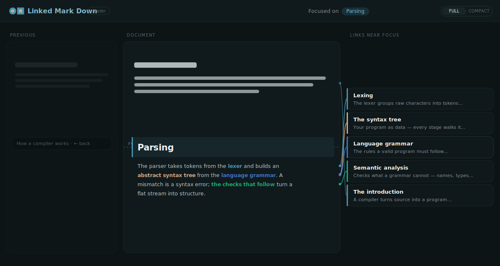
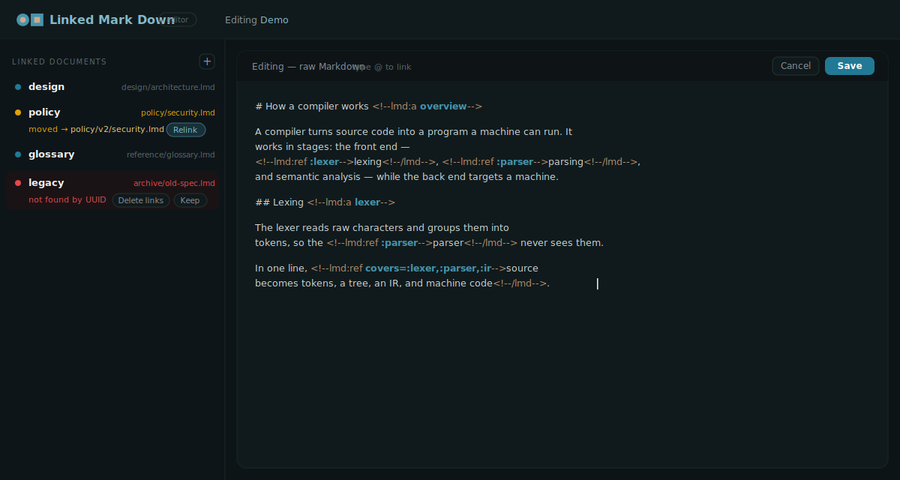

<!-- markdownlint-disable MD033 MD041 -->
<p align="center">
  
</p>
<h1 align="center">Linked Markdown (<code>.lmd</code>)</h1>
<p align="center">
  <em>Markdown you read as plain prose — and that AI and tools read as a typed knowledge graph.</em>
</p>
<p align="center">
  <a href="https://github.com/makeisle/linked-markdown/actions/workflows/ci.yml"></a>
  <a href="LICENSE"></a>
  
</p>

---

## Why Linked Markdown exists

AI agents and their humans produce **a lot** of documents — memory notes, plans,
summaries, specs, hand-offs. Over time you lose track of what was decided where.
Wording drifts, so `grep` no longer reaches it; and the agent doesn't even *know*
to search for something it has forgotten exists. The information is there — the
**recall** fails.

Linked Markdown moves the "what connects to what" decision from *read time*
(fragile keyword search) to *write time* (when the author has full context). A
`.lmd` file is ordinary Markdown that additionally carries:

- a stable **UUID** on every linkable block (identity that survives re-wording),
- **typed edges** between blocks and across documents (a real graph, not prose),
- cross-document **imports** with versioning and drift detection.

All of it lives in HTML comments and YAML front matter that **disappear on
render** — so the same file is clean prose to a person and a navigable graph to a
tool. Vectors stay *outside* the file; the block's UUID is the join key. The file
is the source of truth for **connectivity**, not for floats.

> The result: instead of a pile of files you must remember to search, you get a
> graph you can traverse — authored as you write, maintained by tooling.

## See it

**Live demo** (viewer + editor): **https://linked-markdown.sandevaux.com**
&nbsp;·&nbsp; run it locally: `pnpm --filter @lmd/playground dev`

<p align="center"></p>

The demo shows the two-panel experience:

- a **reader** that renders `.lmd` as clean prose, with the link graph surfaced
  as a side column of anchor cards and leader lines (or, in compact mode, as a
  hover tooltip), and click-through navigation across linked documents;
- an **editor** — a plain raw-Markdown textarea where typing `@` (or `<!--lmd:ref `)
  opens an autocomplete to link a span to one or more anchors, with a sidebar that
  manages the documents you import and detects when a linked file has moved.

<p align="center"></p>

<sub>Illustrative mockups of the UI. Try the real thing at the live demo above.</sub>

## What a `.lmd` looks like

````markdown
---
lmd: 1
id: 0192f3a1-7c2e-7b3d-9f10-aa01cap00001
version: 3
title: Requirements
imports:
  design: { id: 0192…design0001, path: "design.lmd", pin: "@7" }
---

## Membership authentication <!--lmd:a cap-auth-->

Users sign up through <!--lmd:ref impacts=:uc-join parent=design:capability-auth-->a
trusted path<!--/lmd-->, which must satisfy
<!--lmd:ref invariant=:privacy-->the privacy invariant<!--/lmd-->.
````

- **Anchor** — `<!--lmd:a slug-->` marks a block as a linkable target (it gets a UUID).
- **Ref** — `<!--lmd:ref [role=]addr,… …-->source text<!--/lmd-->` wraps a span and
  links it to **1..N** anchors, each with a relationship type. Same syntax for one
  target or many. (A plain Markdown `[text](url)` is just a hyperlink — it carries
  no lmd meaning.)

The full rules are in **[`spec/SPEC.md`](spec/SPEC.md)**; a tutorial is in
**[`spec/SYNTAX.md`](spec/SYNTAX.md)**.

## Quick start (CLI)

```bash
# from the repo (until published binaries exist)
cargo run -q -p lmd-cli -- new spec.lmd --title "My specification"
cargo run -q -p lmd-cli -- build spec.lmd   # mint/keep UUIDs, resolve links, refresh the manifest
cargo run -q -p lmd-cli -- check spec.lmd   # validate integrity (fix every error)
```

`build` owns the trailing `<!--lmd:manifest …-->` block — you edit the body, it
maintains identity, the resolved graph, and content hashes.

## Use it with your AI

Linked Markdown is designed to be authored *by* AI agents, so the same connective
tissue that helps the agent also helps you.

- **Claude** — an authoring **skill** and a **plugin** (this repo is a Claude Code
  plugin marketplace). The plugin adds commands to capture a conversation, its
  plan, and the documents it touched into linked `.lmd` files, so a project's
  memory becomes a graph. See [`plugins/linked-markdown/`](plugins/linked-markdown/)
  and [`skill/SKILL.md`](skill/SKILL.md).
- **ChatGPT / Gemini** — provider-neutral authoring instructions plus ready-to-paste
  Custom GPT and Gem configurations under [`integrations/`](integrations/).

The authoring guidance is model-agnostic; each target just packages it differently.

## Repository layout

This is a hybrid Rust + JavaScript monorepo.

```
crates/
  lmd-core/     Reference implementation: model, parser, canonical serializer,
                address resolver, build & check. Pure Rust, no I/O assumptions.
  lmd-cli/      The `lmd` command-line tool.
  lmd-wasm/     wasm-bindgen bindings exposing lmd-core to JavaScript.
packages/
  @lmd/core     Thin TypeScript wrapper around the wasm bindings (browser + node).
  @lmd/editor   TipTap / ProseMirror bridge for .lmd (round-trips to canonical text).
  @lmd/viewer   Renderer with link-graph overlay (refs, backlinks).
  @lmd/lsp      Language server: diagnostics, completion, definition, references.
apps/
  playground    Live editor + viewer demo (hosted on GitHub Pages).
  docs          Documentation site (VitePress): spec, syntax, guides.
extensions/
  vscode        VS Code extension: .lmd grammar + language-server client.
skill/          A Claude skill for authoring .lmd documents.
plugins/        Claude Code plugin(s); the repo root is a plugin marketplace.
integrations/   Provider-neutral + ChatGPT/Gemini authoring configs.
conformance/    Golden fixtures + runner — the authority for "is this a valid lmd
                implementation?", shared by every implementation.
examples/       Sample documents and multi-document workspaces.
```

## The reference implementation *is* the spec, made executable

`crates/lmd-core` is canonical. Any other implementation (a pure-TS port, a Go
port, …) is "correct" exactly when it passes the shared fixtures in
[`conformance/`](conformance/). The Rust crate compiles natively for the CLI and
to WebAssembly for the browser — one source of truth, two targets.

## Status

**Pre-alpha.** The spec is at **v1** and frozen for the initial milestones; the
tooling is built bottom-up (core → skill → viewer → editor → docs → distribution).
Expect breaking changes until a tagged release.

## Contributing

See [`CONTRIBUTING.md`](CONTRIBUTING.md) — the short version: **conformance is the
contract**, so any change to the bytes a conformant implementation must produce
comes with a fixture. By participating you agree to the
[Code of Conduct](CODE_OF_CONDUCT.md).

## License

Apache-2.0. See [`LICENSE`](LICENSE) and [`NOTICE`](NOTICE).
